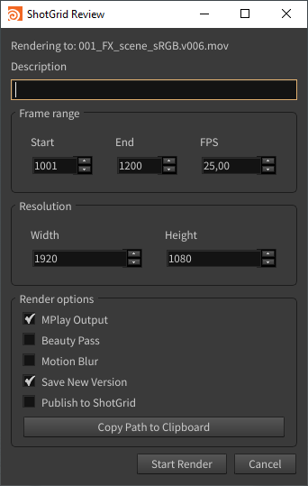
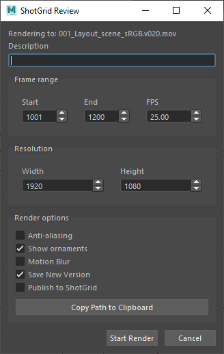
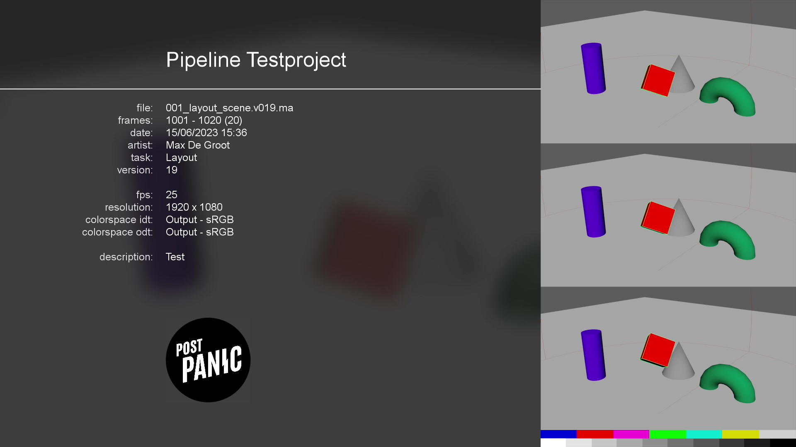
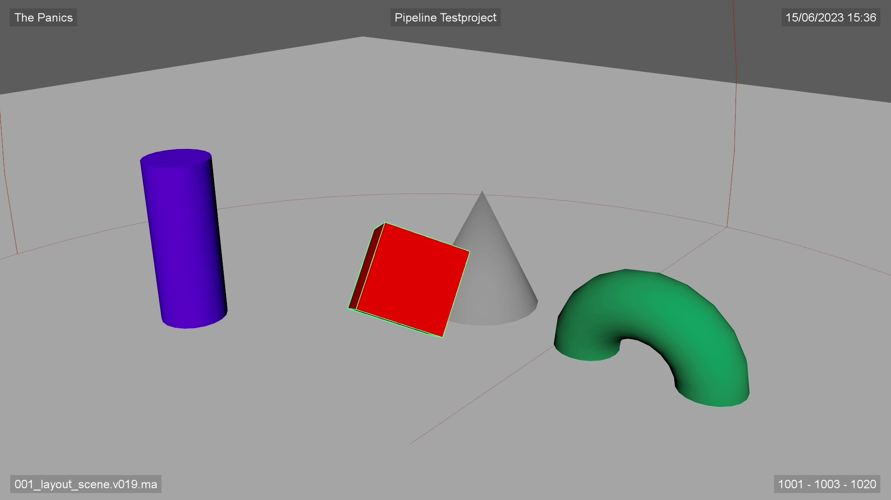

# tk-multi-reviewsubmission2

Easily create and publish QuickTime preview renders (flipbooks/playblasts) from the ShotGrid menu.

Supported toolkits: `tk-houdini`, `tk-maya`

_Requires Nuke for creating slates._

|                             Houdini                              |                          Maya                           |
|:----------------------------------------------------------------:|:-------------------------------------------------------:|
|  |  |

Slate

Review

## Configuration

### Strings

| Key              | Description                                                |
|------------------|------------------------------------------------------------|
| `company_name`   | Specify the company name that should be on the slates      |
| `display_name`   | Specify the name that should be used in menus and the main |
| `cut_in_field`   | ShotGrid field name of cut in frame                        |
| `cut_out_field`  | ShotGrid field name of cut out frame                       |
| `fps_field`      | ShotGrid field name of fps                                 |

### Paths

| Key                 | Description                                                 |
|---------------------|-------------------------------------------------------------|
| `nuke_path_linux`   | Linux path to your Nuke installation for creating slates.   |
| `nuke_path_mac`     | Mac path to your Nuke installation for creating slates.     |
| `nuke_path_windows` | Windows path to your Nuke installation for creating slates. |
| `slate_logo`        | Relative app path to the logo displayed on the slate        |

### Templates

| Key                    | Description                            |
|------------------------|----------------------------------------|
| `work_file_template`   | Template for your current work file.   |
| `review_file_template` | Template for the exported review file. |

### Hooks

| Key                 | Description                                                   |
|---------------------|---------------------------------------------------------------|
| `helper_hook`       | Implements helper functions.                                  |
| `progress_hook`     | Implements progress bar functions.                            |
| `render_media_hook` | Implements how media get generated while this app is running. |

## License

[MIT](https://choosealicense.com/licenses/mit/)
